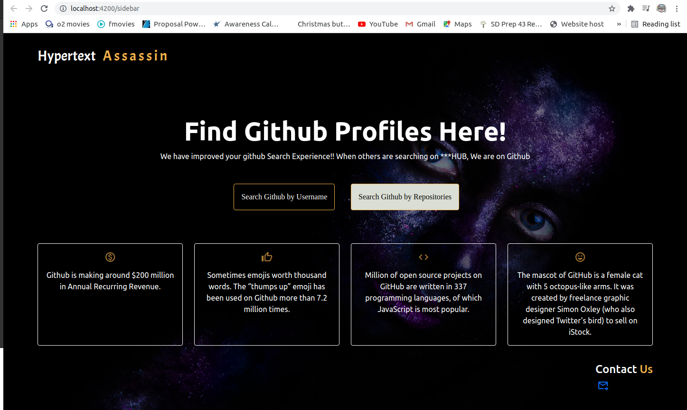
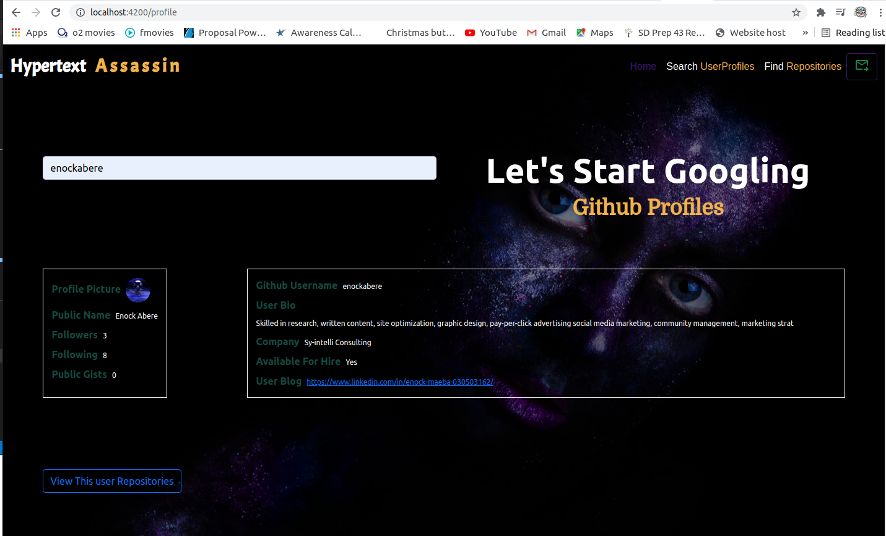
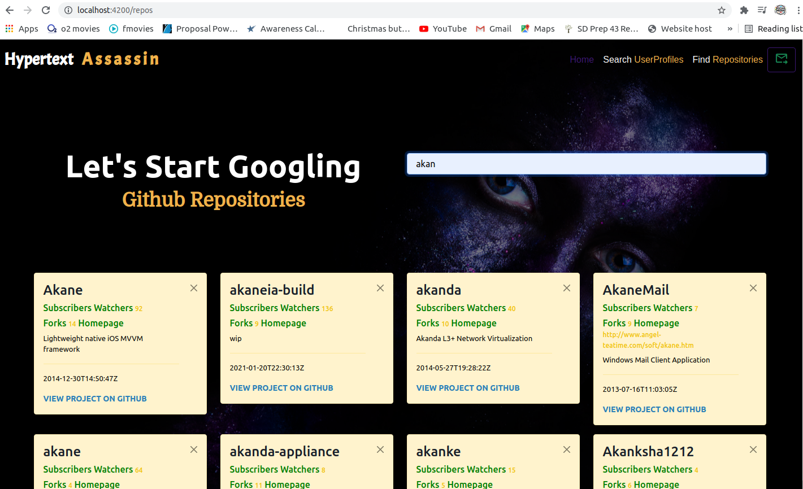
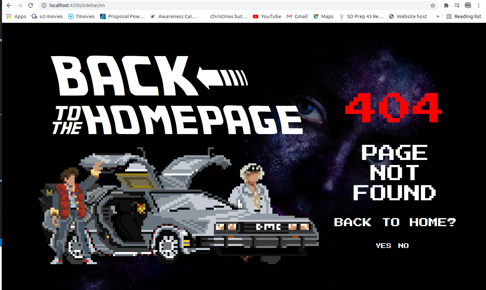

# Git-Google/Git-Search
## Project Description
A Github googler that allows users to search for Github users by username and Github repositories by repository names. 
##### By Enock Abere 

###### Dated 29/07/2021.

### Landing Page
    On the landing page, there is a brief definition of what the application is about, buttons to redirect users to the respective routes (Search Github by Username and Search Github by Repositories), quick facts about Github and Contact us section at the bottom. 

#### Behavior Driven Development
* By clicking on ***Search Github by Username*** the page redirects to another page where a visitor can search for github profile.

* Clicking on ***Search Github by Repositories*** button the page redirects to another page where a visitor can search for github repositories.

* Contact Us ***Envelope Icon*** at the bottom of the page prompts the visitor to write a direct email to the developer.

#### Landing Page Display

### Search Github by Username page

#### Description
    This page allows users to search for Github users by usernames only.

#### Behavior Driven Development
* There is ***navigation bar*** to redirect the user to the home page/landing page, search by repositories page and contact us button that sends a direct message to the developer.

* Start typing usernames of the github repositories that you want to find on an the provided input form and relevant profiles and repositories will start showing up as you type.

* Once you are done typing the usernames, the page visitor will first see the background information of the searched user and ***View this user Repository*** button that will scroll the page to view repositories of that user.

* On the searched user repository there is a menu to redirect the user back to the home page/landing page and to where the user can perform the next search of another profile.

#### Search Github by Username page Display

### Search Github by Repositories page

#### Description
    This page allows users to search for Github users by repository names only.

#### Behavior Driven Development
* There is ***navigation bar*** to redirect the user to the home page/landing page, search by repositories page and contact us button that sends a direct message to the developer.

* Type a repository name on the form and related repositories will start showing up as you type.

* Once you are done typing the repository names, the page visitor will first see repositories popping up on cards with information about the repository and link to view it on github.

#### Search Github by Repositories page Display

### 404 Error Page

#### Description
    This is an error page indicating that the browser was able to communicate with server but not able to find the page visitor request.

#### Behavior Driven Development
* The page will ask the visitor whether he/she wishes to navigate back to the Landing page. If yes, the visitor will be redirected to the landing page and if No the user will get an alert asking him/her to close the page.

#### 404 Error Page Display

## Live link
Visit the application on https://enockabere.github.io/Git-Search/.

## Development

#### Development server

Run `ng serve` for a dev server. Navigate to `http://localhost:4200/`. The app will automatically reload if you change any of the source files.

#### Code scaffolding

Run `ng generate component component-name` to generate a new component. You can also use `ng generate directive|pipe|service|class|guard|interface|enum|module`.

#### Build

Run `ng build` to build the project. The build artifacts will be stored in the `dist/` directory. Use the `--prod` flag for a production build.

#### Running unit tests

Run `ng test` to execute the unit tests via [Karma](https://karma-runner.github.io).

#### Running end-to-end tests

Run `ng e2e` to execute the end-to-end tests via [Protractor](http://www.protractortest.org/).

#### Making modifications

To make advancements/modifications, follow these steps:

- Fork the repository
- Create a new branch (`git checkout -b x-feature`)
- Make the appropriate changes in the files
- Add changes made
- Commit your changes (`git commit -am 'x-feature'`)
- Push to the branch (`git push origin x-feature`)
- Create a Pull Request 

## Technologies Used

This project was generated with [Angular CLI](https://github.com/angular/angular-cli) version 12.1.3.
The technologies used are HTML, CSS, Typescript, Material UI and Bootstrap.

## Support and contact details

Should you be unable to access the website, have any recommendations and/or questions, feel free to email me:[anock.abere@student.moringaschool.com](mailto:anock.abere@student.moringaschool.com)

## To-do
1. Include toggling when the api responses are too big

## License
    ​Permission is hereby granted, free of charge, to any person obtaining a copy of this software and associated documentation files (the "Software"), to deal in the Software without restriction, including without limitation the rights to use, copy, modify, merge, publish, distribute, sublicense, and/or sell copies of the Software, and to permit persons to whom the Software is furnished to do so, subject to the following conditions:​The above copyright notice and this permission notice shall be included in all copies or substantial portions of the Software.

    ​THE SOFTWARE IS PROVIDED "AS IS", WITHOUT WARRANTY OF ANY KIND, EXPRESS OR IMPLIED, INCLUDING BUT NOT LIMITED TO THE WARRANTIES OF MERCHANTABILITY, FITNESS FOR A PARTICULAR PURPOSE AND NONINFRINGEMENT. IN NO EVENT SHALL THE AUTHORS OR COPYRIGHT HOLDERS BE LIABLE FOR ANY CLAIM, DAMAGES OR OTHER LIABILITY, WHETHER IN AN ACTION OF CONTRACT, TORT OR OTHERWISE, ARISING FROM, OUT OF OR IN CONNECTION WITH THE SOFTWARE OR THE USE OR OTHER DEALINGS IN THE SOFTWARE

Copyright (c) 2021 [Enock Abere](https://github.com/enockabere)  

